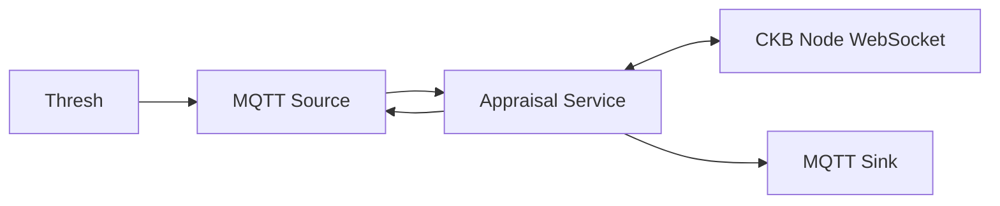

# Appraisal - Be with Thresh, extended the inputs detail of CKB's transaction info

[](https://opensource.org/licenses/MIT)


A high-performance service that enriches CKB transaction data by recursively resolving input details through WebSocket RPC calls. Built with async Rust, it implements a non-blocking architecture to handle concurrent transaction processing efficiently.

## Features

- **Asynchronous Processing**: Leverages Tokio runtime for non-blocking I/O operations
- **Batch Processing**: Optimizes RPC calls by batching transaction queries
- **Concurrent Handling**: Configurable concurrency limits for optimal performance
- **Real-time Communication**: WebSocket for CKB node interaction and MQTT for pub/sub messaging
- **Robust Error Handling**: Comprehensive error propagation and logging
- **Docker Support**: Containerized deployment with configurable environments

## Architecture



The service subscribes to raw transaction events, enriches them with input details by querying the CKB node, and publishes the enhanced transactions to a designated MQTT topic.

## Prerequisites

- Rust 1.73 or higher
- Docker and Docker Compose (optional)
- Running CKB node with WebSocket RPC enabled
- MQTT broker (e.g., Mosquitto)

## Installation

### From Source

```bash
# Clone the repository
git clone https://github.com/yourusername/appraisal.git
cd appraisal

# Build the project
cargo build --release

# Run the service
cargo run --release
```

### Using Docker

```bash
# Build the image
docker-compose build

# Start the service
docker-compose up -d
```

## Configuration

Configuration is managed through environment variables:

| Variable | Description | Default |
|----------|-------------|---------|
| `RUST_LOG` | Logging level | `info` |
| `CKB_WS_URL` | CKB node WebSocket URL | `ws://localhost:8114` |
| `MQTT_HOST` | MQTT broker host | `localhost` |
| `MQTT_PORT` | MQTT broker port | `1883` |
| `MQTT_CLIENT_ID` | MQTT client identifier | `ckb-tx-detail-service` |
| `CONCURRENT_REQUESTS` | Maximum concurrent RPC requests | `10` |

## Usage

The service subscribes to `ckb.transactions.proposed` MQTT topic and publishes enriched transactions to `ckb.transactions.proposed.detailed`.

Example enriched transaction:

```json
{
  "hash": "0x...",
  "inputs": [
    {
      "previous_output": {
        "index": "0x0",
        "tx_hash": "0x..."
      },
      "since": "0x0",
      "capacity": "0x34e62ce00",
      "lock": {
        "args": "0x...",
        "code_hash": "0x...",
        "hash_type": "type"
      },
      "type_script": null
    }
  ],
  // ... other transaction fields
}
```

## Development

### Running Tests

```bash
# Run all tests
cargo test

# Run tests with logging
RUST_LOG=debug cargo test -- --nocapture
```

### Benchmarking

```bash
cargo bench
```

## Contributing

1. Fork the repository
2. Create your feature branch (`git checkout -b feature/amazing-feature`)
3. Commit your changes (`git commit -am 'Add some amazing feature'`)
4. Push to the branch (`git push origin feature/amazing-feature`)
5. Open a Pull Request

## Performance Considerations

- The service implements connection pooling for WebSocket connections
- Batch processing reduces RPC overhead
- Configurable concurrency limits prevent resource exhaustion
- Error backoff strategies for resilient operation

## License

This project is licensed under the MIT License - see the [LICENSE](LICENSE) file for details.

## Acknowledgments

- [CKB Documentation](https://github.com/nervosnetwork/ckb)
- [MQTT](https://mqtt.org/)

## Related Projects
- [Thresh](https://github.com/nervape/thresh)
- [CKB](https://github.com/nervosnetwork/ckb)
- [CKB SDK](https://github.com/nervosnetwork/ckb-sdk-rust)

---

For more information or support, please open an issue or contact the maintainers.
